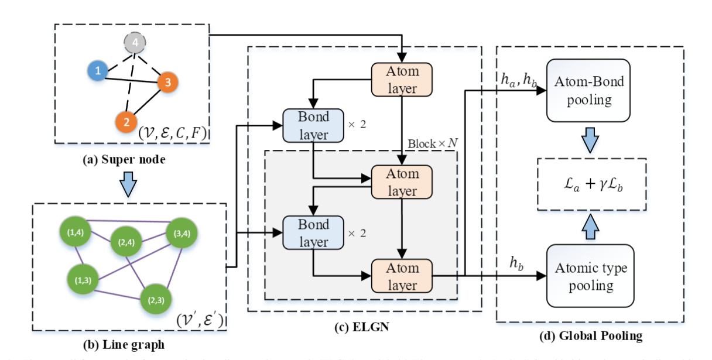

## ELGN

<p align="center">
  
  <br />
</p> 

### Usage

Clone this repo.

```
https://github.com/gnn4bio/ELGN.git
```

#### code structure

- `dataset.py:` code for constructing a dataset representing interaction graphs in protein-ligand complexes.
- `fetureizer.py:` calculates atomic features for molecules, wherein the features can encode atom type, native Pybel properties, or any property defined with SMARTS patterns.
- `layers.py:` implementation of each layer in the model.
- `model.py:` ELGN model.
- `preprocess_pdbbind.py:` preprocess the protein-ligand complex dataset.
- `train.py:` train ELGN model.
- `utils.py:` some tools for ELGN.
- `requirement.txt:` libs for ELGN.

#### Datasets

We refer to the data processing of  “Structure-aware Interactive Graph Neural Networks for the Prediction of Protein-Ligand Binding Affinity”。[Github](https://github.com/agave233/SIGN)

The PDBbind dataset can be downloaded [here](http://pdbbind-cn.org).

The CSAR-HiQ dataset can be downloaded [here](http://www.csardock.org).

You may need to use the [UCSF Chimera tool](https://www.cgl.ucsf.edu/chimera/) to convert the PDB-format files into MOL2-format files for feature extraction at first.

Alternatively, we also provided a [dropbox link](https://www.dropbox.com/sh/2uih3c6fq37qfli/AAD-LHXSWMLAuGWzcQLk5WI3a) for downloading PDBbind and CSAR-HiQ datasets.

The downloaded dataset should be preprocessed to obtain features and spatial coordinates:

```
python preprocess_pdbbind.py --data_path_core YOUR_DATASET_PATH --data_path_refined YOUR_DATASET_PATH --dataset_name pdbbind2016 --output_path YOUR_OUTPUT_PATH --cutoff 5
```

The parameter cutoff is the threshold of cutoff distance between atoms.

You can also use the processed data from [this link](https://www.dropbox.com/sh/68vc7j5cvqo4p39/AAB_96TpzJWXw6N0zxHdsppEa). Before training the model, please put the downloaded files into the directory (./data/).

#### How to run

To train the model, you can run this command:

```
python train.py --cuda YOUR_DEVICE --model_dir MODEL_PATH_TO_SAVE --dataset pdbbind2016 --cut_dist 5 
```

### Acknowledgments

Our code refers to "Structure-aware Interactive Graph Neural Networks for the Prediction of Protein-Ligand Binding Affinity", thanks to the authors.


